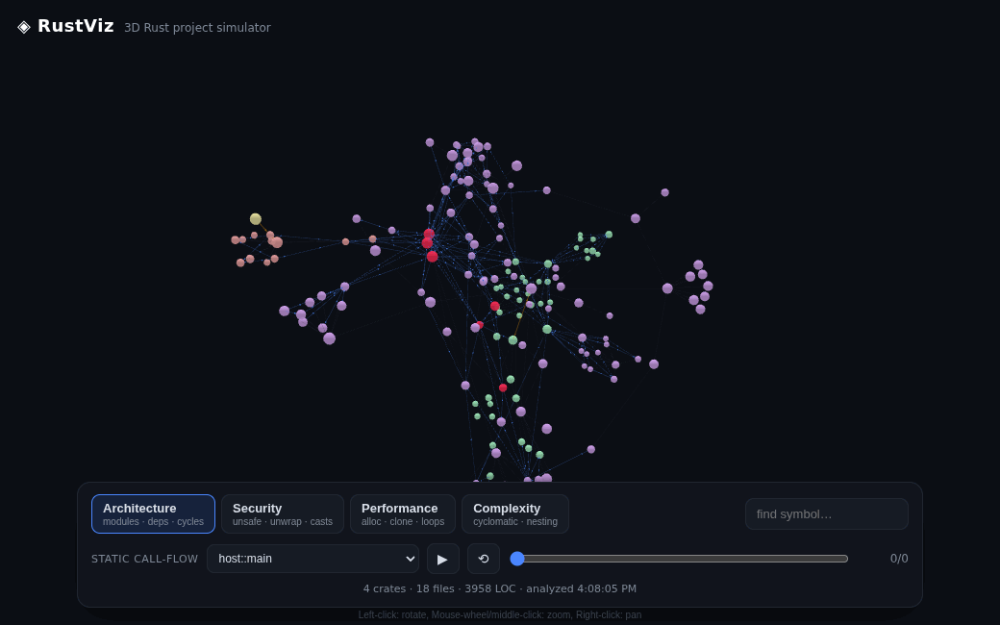

# RustViz — Rust Architecture Overview

Analyze any Rust project and survey its **architecture at a glance** in the browser:
a treemap of crates → modules where **tile area = lines of code** and **color = crate**
(the structural base view) **or one of three evaluation lenses** (Security, Performance,
Complexity). No function-node hairball — the structure is the picture.



```bash
rustviz /path/to/your/rust/project
# → analyzes the workspace, serves http://127.0.0.1:7878, opens your browser
```

## What it shows

- **Crate → module treemap.** Each crate is an outlined region; the tiles inside are its
  top-level modules, sized by total LOC. The whole 20K-line codebase fits on one screen.
- **Structure** (the default view) colors each tile by its crate, so you read crate
  composition at a glance; dependency-cycle modules are outlined in red.
- **Three metric lenses** recolor the same map, so you compare *the same structure* across axes:
  | Lens | Color | Surfaces |
  |------|-------|----------|
  | Security | blue→red heat | unsafe, unwrap/expect, panic!, raw ptr, transmute, lossy casts |
  | Performance | blue→red heat | allocations, clone, nested loops, recursion, collect, await |
  | Complexity | teal→violet | cyclomatic complexity + size |
- **Dependency overlay** (`⇄ deps`) draws crate-to-crate dependency arrows over the map;
  mutual (cyclic) dependencies are red.
- **Inspector** — click a tile to see its aggregated metrics, which crates it depends on /
  is used by, cycle membership, and its functions ranked by the active lens (or by size in
  the structure view). Click a function to read its actual source.
- **Search** — jump to any module by name.

Metrics aggregate bottom-up: the analyzer emits raw per-function counts, the frontend sums
them per module and normalizes across tiles. Switching lenses is an animated recolor.

## How it works

Three loosely-coupled layers joined by one JSON contract (see
[docs/architecture.md](docs/architecture.md)):

```
rustviz <path>
  [1] analyzer (Rust)  cargo_metadata + syn AST walk → graph with per-fn raw metrics
        ↓ JSON
  [2] server  (Rust)   axum: /api/analyze, /api/source, embedded web assets
        ↓ HTTP (127.0.0.1)
  [3] web     (TS)     aggregate to crate/module treemap (d3-hierarchy), lens recolor
```

The analyzer emits only raw metric counts plus a normalized score; all aggregation and
visual mapping live in the frontend, so adding a new lens is a one-file change
(`web/src/lenses.ts`).

## Install & run

Prerequisites: a Rust toolchain (1.75+) and Node 18+ (only to build the frontend).

```bash
cd web && npm install && npm run build && cd ..    # build the embedded UI bundle
cargo run --release -p rustviz-server -- /path/to/project
```

### Useful flags

```bash
rustviz <path> --port 9000     # serve on a different port
rustviz <path> --no-open       # don't auto-open the browser
rustviz <path> --dump          # print the analysis JSON to stdout and exit
```

## Development

```bash
cargo run -p rustviz-server -- /path/to/project --no-open   # backend API on :7878
cd web && npm run dev                                       # Vite + HMR on :5173
cargo test -p rustviz-analyzer                              # analyzer tests
```

## Limitations

- Dependency cycles and crate edges come from a name-based syntactic analysis (`syn` is a
  parser, not a name resolver). Calls to functions defined in the workspace resolve cleanly;
  external calls never create spurious edges.
- Macro-expanded code is not analyzed (the pre-expansion source is).

## Tech stack

`syn` · `cargo_metadata` · `petgraph` · `axum` · `rust-embed` (Rust) ·
`d3-hierarchy` · `react` · `zod` · `vite` (TypeScript)
